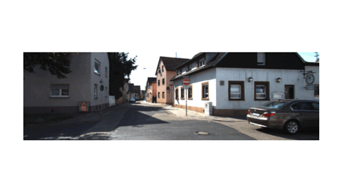

# Hybrid Transformer Based Feature Fusion for Self-Supervised Monocular Depth Estimation 
Advances in Image Manipulation, European Conference on Computer Vision Workshops (ECCVW) 2022

> + Authors: [Snehal Singh Tomar](https://www.snehalstomar.github.io), [Maitreya Suin](https://maitreyasuin.github.io), and [A.N. Rajagopalan](https://www.ee.iitm.ac.in/raju/)
> + Paper: [ECCVW 2022 arXiv preprint](https://arxiv.org/abs/2211.11066)

<p align="center">
  
</p>


## Setup

Our setup for this project entailed the following:

> CUDA 10.0, cuDNN 7.5.0, Python 3.6, Pytorch 0.4.1, Torchvision 0.2.1, OpenCV 3.3.1, and Ubuntu 20.04.

### Bibtex
If you use this code, please cite our paper:
```
@inproceedings{tomar2022hybrid,
  title={Hybrid Transformer Based Feature Fusion for Self-Supervised Monocular Depth Estimation},
  author={Tomar, Snehal Singh and Suin, Maitreya and Rajagopalan, A.N.},
  booktitle={Advances in Image Manipulation, European Conference on Computer Vision Workshops (ECCVW) 2022},
  year={2022}
}
```

### License

This code is for non-commercial use only. Please refer to our License file for more.

### Acknowledgement

This implementation borrows heavily from [Monodepth2](https://github.com/nianticlabs/monodepth2), and draws inspiration from the [DIFFNet](https://github.com/brandleyzhou/DIFFNet). 